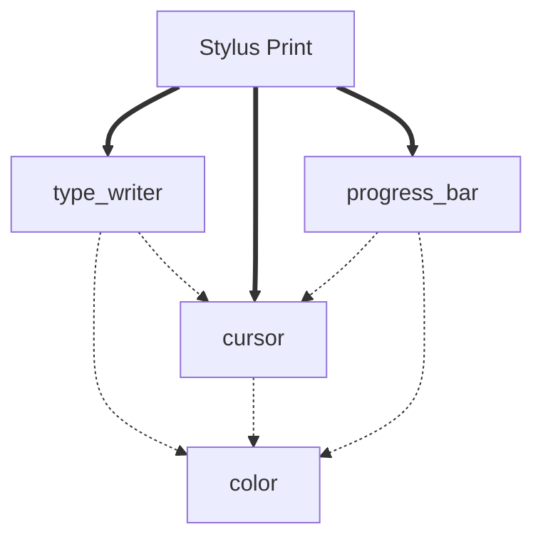

# Stylus Print ✨🖋️

`stylus_print` is a library of different modules to make your cli text representation, more alive.

# Features 🌟

- Typewriter Effects: Character-by-character text animation

- Cursor Customization: built-in cursor styles with animation

- Color Support: color palettes based on ansi escape_chars

- Multi-Speed Control: Adjustable character delay

<!-- - Pythonic API: Simple yet powerful interface -->

<!-- # Installation ⚙️

```python
pip install stylus-print
``` -->

<!-- # each simple usage explanation -->

<!-- needs work -->

# Structure



AS it has been demostrated in the diagram, `type_writer`, `progress_bar` and `cursor` are the main modules and use of `cursor` and `color` modules in other ones is optional.
