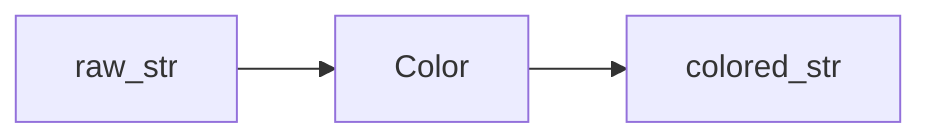

# Color

**Color** module consists of a simple `color_decorator` to wrap given function with string return, into chosen ansii coloring strings; and a more robust `Color` class to have and option to choose different representation styles form animating and ofcourse to make easier objects to pass to other **Stylus_print** modules.

color object will consist of below arguments:

- `color_choice` (`str | None`): specify color representation from basic choices of ["red", "green", "yellow", "blue", "none"].

- `color_code` (`str | None`): specify ansi string color representation to be added to text. if given value it will overwrite `color_choice`.

- `color_style` (`str | None`): coloring style for each iteration of the object. choices are ["all", "rainbow", "rainbow-char"]. if needed more midfication for coloring you can give function as keyword argument to `color_func`.

- `color_func` (`function | None`): Specify if you need specific coloring function for each iteration at higher level modules. if given value, will overwrite `color_style`. supports lambda functions [`index_condition`, `char_condition = True`] (2nd var for lambda as char_condition is optional).

example?
